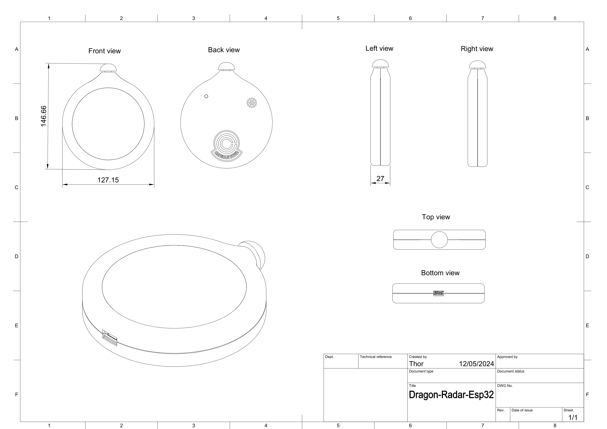
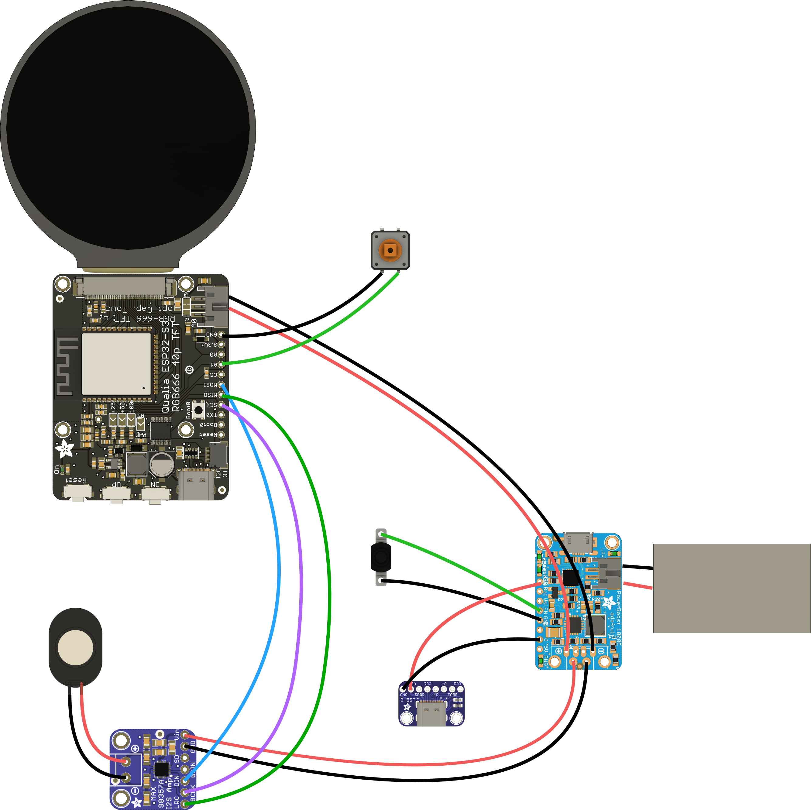
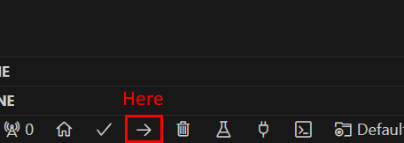

# dragon-radar (ESP32 Version)

The aim of this project is to describe how I have created a reproduction of the dragon radar based on an ESP32. (Another version based on a Raspberry Pi Zero can be found here https://github.com/ThorAsgardDev/dragon-radar).

A video preview is available here: https://youtu.be/3WBsvo2bpxI

## Drawing

## Hardware

### Bill of materials

| Component | The place where I got it |
| --------- | ------------------------ |
| Adafruit Qualia ESP32-S3 for TTL RGB-666 Displays | [Link](https://www.adafruit.com/product/5800) |
| Round RGB TTL TFT Display - 4" 720x720 - NV3052C | [Link](https://www.adafruit.com/product/5793) |
| PowerBoost 1000 Charger - Rechargeable 5V Lipo USB Boost @ 1A - 1000C | [Link](https://www.adafruit.com/product/2465) |
| Lithium Ion Polymer Battery - 3.7v 1200mAh | [Link](https://www.adafruit.com/product/258) |
| Adafruit I2S 3W Class D Amplifier Breakout - MAX98357A | [Link](https://www.adafruit.com/product/3006) |
| Adafruit USB Type C Breakout Board - Downstream Connection | [Link](https://www.adafruit.com/product/4090) |
| Mini Oval Speaker - 8 Ohm 1 Watt | [Link](https://www.adafruit.com/product/3923) |
| STEMMA JST PH 2mm 3-Pin to Male Header Cable - 200mm | [Link](https://www.adafruit.com/product/3893) |
| Mini On/Off Push-Button Switch | [Link](https://www.adafruit.com/product/3870) |
| Colorful Round Tactile Button Switch Assortment - 15 pack | [Link](https://www.adafruit.com/product/1009) |
| Black Nylon Machine Screw and Stand-off Set – M3 Thread | [Link](https://www.adafruit.com/product/4685) |
| Brass Heat-Set Inserts for Plastic - M3 x 4mm - 50 pack | [Link](https://www.adafruit.com/product/4255) |

A 5V USB-C charger is also required to charge the dragon radar battery.

### Connection diagram

## Fixings
To fix components inside the case I used glue sticks and inserts/screws.
The inserts and screws are M3. Unfortunately the PCBs holes are M2.5 so they must be enlarged. I used a mini steel needle, 3mm x 140mm round file like this one: [round file](https://www.amazon.com/Utoolmart-Circular-Section-Precision-Monochrome/dp/B07XB6HGJ7/ref=sr_1_3?crid=H3N1ASWV5HZE&dib=eyJ2IjoiMSJ9.V5cxUJMIxyE37j-yd4PeuJC2SHTFfydHmknrFYKnfriGv_r9UWDstD5KV4lo0DPMhOU0B27syJ4-kfscgKfTM8g_jjGXkwiz_ANzW1Pxvi0p3ffxooiFsPu1gNvCmvYpURQYUWREyAakD3nNAZOh6nvftQ_v-tcZ8rtswJP59iZenagRKnLYsGU1UKZowwgjm7xogrjXlk6Wpt3mr9mVHq34O46NFfJuxCeszojExAvRiXk_mxHM-fPfyKEMWN3VxkcdoBSq1ljZObsIrZIbUcaMePTvVA3bQu5wYEkgSmw.GvpS5KuGrzxoN1UuvlVTE6FnMl84uZ08-pXsrSIcxho&dib_tag=se&keywords=Round%2Bneedle%2Bfile%2B3mm%2BFor%2Bprecision%2Bmechanics&qid=1715586113&sprefix=round%2Bneedle%2Bfile%2B3mm%2Bfor%2Bprecision%2Bmechanics%2Caps%2C125&sr=8-3&th=1).

## Case
I have designed the case using Fusion 360.

Here are the files: [case.zip](./case/stl-files.zip)

For a better result I have sent the STL files to [Sculpteo](https://www.sculpteo.com/fr/).

Material: SLS (Plastic), Nylon PA12 100-120µ (White)
- Finition: Polish, White for external parts: back.stl, font.stl, button-cap.stl
- Finition: Raw/Unpolished, White for internal parts: button-blocker.stl, plate.stl, power-switch-blocker.stl 

## Assembly

https://github.com/ThorAsgardDev/dragon-radar-esp32/assets/39161691/d4bff4bd-0f83-4378-85a0-a3110c95d2b1

Wire length used:
- Speaker: keep entire wires
- PowerBoost to power button: 80mm
- PowerBoost to audio amplifier: 120mm
- PowerBoost to USB-C breakout: 90mm
- PowerBoost to ESP32: 300mm
- ESP32 to push button: 85mm
- ESP32 to audio amplifier: 105mm

## Software

Here are the steps to send the dragon-radar program into the ESP32:

1. Install Visual Studio Code and the PlaformIO plugin.
1. Open the software/dragon-radar directory.
1. Plug a USB cable beetwen your PC and the USB-C (not the USB-C breakout but the one directly on the ESP32 board)
1. Place the ESP32 in the bootloader mode. To do that you have to perform the following manipulation:
   - Look for the Reset button and the Boot0 button on the ESP3 board
   - Press Boot0 button
   - Press Reset button (while keeping Boot0 button pressed)
   - Release Reset button
   - Release Boot0 button
   
   The manipulation looks like this:
   
   https://github.com/ThorAsgardDev/dragon-radar-esp32/assets/39161691/a2027b4b-ae0c-44f7-b7c5-c5ee43b09e98

1. Click the upload button.
   
1. Press the ESP32 Reset button.
